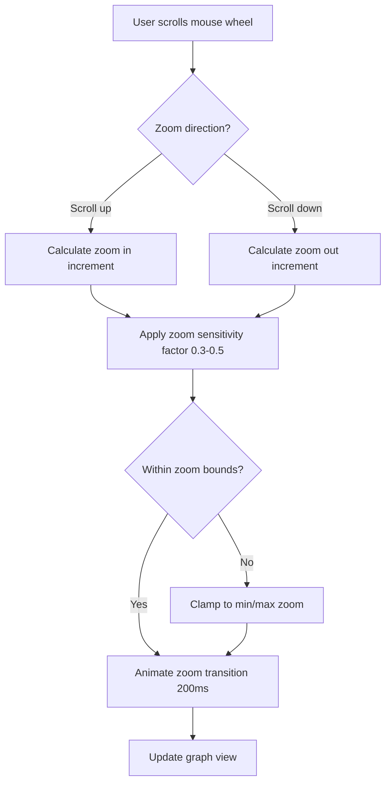
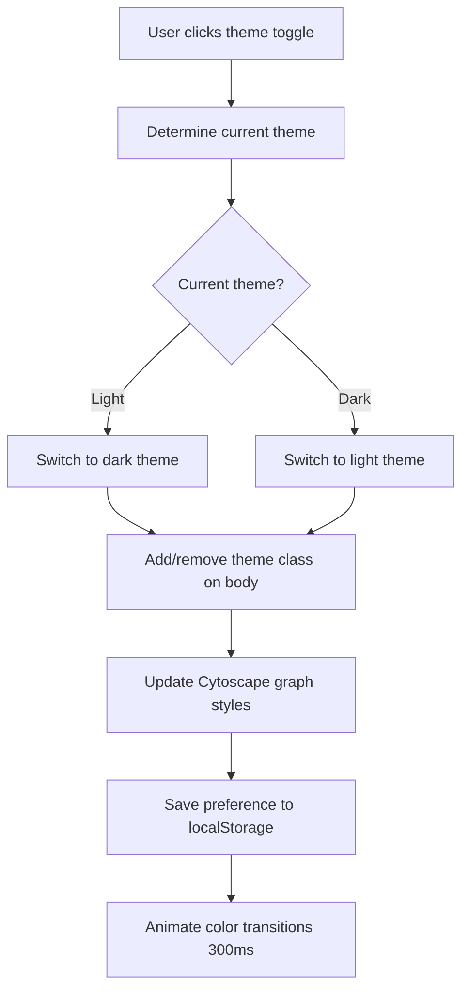
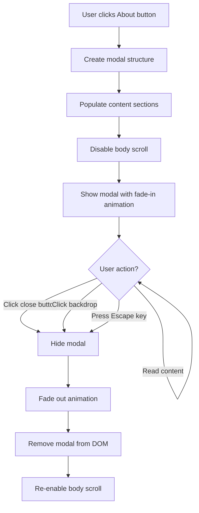

# Feature Design: Graph Homeomorphism Checker Improvements

## Overview

This design outlines enhancements to the Graph Homeomorphism Checker application to improve user experience, add visual appeal, and provide better educational context. The improvements include adjustable zoom speed for graph interactions, a dark/light theme toggle, and an informational About page describing the algorithms and technologies used.

## Design Goals

- Enhance graph interaction experience by making zoom behavior more controlled and intuitive
- Provide theme customization to accommodate different user preferences and lighting conditions
- Add educational value through comprehensive documentation accessible within the application
- Maintain the clean, modern aesthetic of the existing application
- Ensure all changes are compatible with the vanilla JavaScript technology stack

## Feature Requirements

### 1. Adjustable Zoom Speed

**Objective**: Make zoom in/out operations on graph canvases slower and more controlled for better precision when viewing complex graphs.

**Behavior**:
- Zoom speed should be reduced from the default Cytoscape.js behavior
- Zoom transitions should feel smooth and gradual
- Minimum and maximum zoom levels should prevent users from zooming too far in or out
- Both mouse wheel and pinch-to-zoom gestures should respect the new speed settings

**Configuration Parameters**:

| Parameter | Current Value | Proposed Value | Rationale |
|-----------|---------------|----------------|-----------|
| Zoom Sensitivity | Default (1.0) | 0.3 - 0.5 | Reduces zoom speed by 50-70% for finer control |
| Min Zoom Level | Default (0.1) | 0.5 | Prevents excessive zoom-out |
| Max Zoom Level | Default (10.0) | 3.0 | Prevents excessive zoom-in |
| Zoom Animation Duration | Instant | 200ms | Adds smooth transition effect |

### 2. Dark/Light Theme Toggle

**Objective**: Provide users with the ability to switch between dark and light color schemes to reduce eye strain and match personal preferences.

**User Interface**:
- Toggle control located in the header area, near the title
- Visual indicator showing current theme state (moon icon for dark mode, sun icon for light mode)
- Toggle should be accessible and visually distinct
- Theme preference should persist across browser sessions using localStorage

**Theme Specifications**:

#### Light Theme (Current Default)

| Element | Property | Value |
|---------|----------|-------|
| Body Background | Gradient | #F5F5F0 to #E8E8E0 |
| Primary Text | Color | #2C3E50 |
| Secondary Text | Color | #5D6D7E |
| Cards/Panels | Background | #FFFFFF |
| Graph Canvas | Background | #FAFAFA |
| Graph Canvas Border | Color | #E8E8E0 |

#### Dark Theme (New)

| Element | Property | Value |
|---------|----------|-------|
| Body Background | Gradient | #1A1A2E to #16213E |
| Primary Text | Color | #E4E4E7 |
| Secondary Text | Color | #A1A1AA |
| Cards/Panels | Background | #0F3460 |
| Graph Canvas | Background | #1A1A2E |
| Graph Canvas Border | Color | #2C3E50 |
| Node Colors (Graph A) | Background | #64B5F6 |
| Node Colors (Graph B) | Background | #FF8A65 |
| Edge Color | Line | #78909C |
| Button Backgrounds | Adjusted | Darker variants of existing gradients |
| Success Message | Background | #1B5E20, Text: #A5D6A7 |
| Failure Message | Background | #B71C1C, Text: #FFCDD2 |
| Info Message | Background | #01579B, Text: #81D4FA |

**Transition Behavior**:
- Theme switch should be animated with smooth color transitions (300ms duration)
- All themed elements should update simultaneously
- Graph visualizations should update their color schemes without losing structure or position

### 3. About Information Page

**Objective**: Provide users with comprehensive information about the algorithms, technologies, and educational concepts behind the application.

**Access Method**:
- "About" button/link in the header section
- Opens as a modal overlay to avoid navigation away from the main application
- Modal should be dismissible via close button or clicking outside the content area

**Content Structure**:

#### Section 1: Application Overview
- Brief description of the tool's purpose
- Key features summary
- Use cases and educational value

#### Section 2: Algorithms Explained

**Homeomorphism Detection Algorithm**:
- Definition of graph homeomorphism
- Step-by-step explanation of the simplification process
- Description of degree-2 node removal strategy
- Explanation of how simplified graphs are compared
- Time complexity analysis: O(n² + m) for simplification, plus isomorphism check complexity

**Isomorphism Detection Algorithm**:
- Definition of graph isomorphism
- Quick rejection criteria (node count, edge count, degree sequence matching)
- Backtracking approach for finding vertex mappings
- Adjacency preservation verification
- Time complexity discussion: O(n!) worst case, optimized with pruning
- Practical performance notes (efficient up to ~30 nodes)

#### Section 3: Technologies Used

| Technology | Version | Purpose |
|------------|---------|---------|
| JavaScript | ES6+ | Core application logic and algorithms |
| HTML5 | Latest | Document structure and semantics |
| CSS3 | Latest | Styling, animations, and responsive layout |
| Cytoscape.js | 3.23.0 | Graph visualization and interaction engine |

#### Section 4: Graph Theory Concepts

**Key Definitions**:
- Graph homeomorphism: Topological equivalence allowing edge subdivisions
- Graph isomorphism: Structural equivalence with exact node-to-node mapping
- Degree-2 nodes: Nodes with exactly two connections, representing edge subdivisions
- Degree sequence: Sorted list of node degrees used for quick comparison

**Relationship Between Concepts**:
- All isomorphic graphs are homeomorphic
- Homeomorphic graphs may have different node counts
- Isomorphic graphs must have identical node counts

#### Section 5: Usage Instructions
- How to create nodes and edges
- How to load example graphs
- How to interpret results
- Tips for exploring homeomorphism vs isomorphism

**Modal Design Specifications**:

| Property | Value | Rationale |
|----------|-------|-----------|
| Max Width | 800px | Optimal reading width |
| Background Overlay | Semi-transparent black (rgba 0,0,0,0.7) | Focus attention on modal |
| Modal Background | Themed (white in light, dark panel in dark) | Consistency with theme |
| Border Radius | 16px | Match existing design language |
| Padding | 40px | Comfortable reading space |
| Typography | Same as main app | Visual consistency |
| Scrollable Content | Yes (if content exceeds viewport) | Accessibility |
| Close Animation | Fade out (200ms) | Smooth dismissal |
| Open Animation | Fade in + scale (300ms) | Polished appearance |

## Implementation Considerations

### Cytoscape Configuration Changes

The Cytoscape instances will need modifications to their initialization parameters to support the slower zoom behavior:

**Zoom Configuration**:
- Enable zoom animation with custom duration
- Set wheelSensitivity to lower value
- Define minZoom and maxZoom boundaries
- Configure zoom animation easing function for natural feel

### Theme Management Strategy

**CSS Variables Approach**:
- Define all theme colors as CSS custom properties (variables)
- Light theme values set as defaults
- Dark theme applied by adding a class to the body element
- Transitions applied to all themed properties

**State Persistence**:
- Use localStorage to save theme preference
- Check localStorage on page load and apply saved theme
- Default to light theme if no preference is saved

**Dynamic Cytoscape Styling**:
- Cytoscape graph styles cannot use CSS variables directly
- Theme change must trigger Cytoscape style updates via JavaScript
- Node colors and edge colors updated through Cytoscape API

### About Modal Implementation

**Modal Structure**:
- Modal container fixed to viewport
- Semi-transparent backdrop layer
- Content container with scrollable area
- Close button positioned in top-right corner
- Content organized with clear headings and sections

**Interaction Behavior**:
- Clicking backdrop closes modal
- Escape key closes modal
- Focus trapped within modal when open (accessibility)
- Body scroll disabled when modal is open

**Content Presentation**:
- Use semantic HTML structure (sections, headings, lists)
- Include visual separators between major sections
- Use tables for structured data (complexity analysis, technology stack)
- Apply consistent spacing and typography

## User Experience Flow

### Zoom Interaction Flow



### Theme Toggle Flow



### About Modal Flow



## Visual Design Mockup

### Header with New Elements

```
┌──────────────────────────────────────────────────────────────────┐
│  Graph Homeomorphism Checker              [🌙] [ℹ About]        │
│  Two graphs are homeomorphic if one can be transformed...        │
└──────────────────────────────────────────────────────────────────┘
```

### About Modal Structure

```
┌────────────────────────────────────────────────────────────────────┐
│  ┌──────────────────────────────────────────────────────────┐ [✕] │
│  │  About Graph Homeomorphism Checker                           │   │
│  │                                                              │   │
│  │  OVERVIEW                                                    │   │
│  │  An interactive tool for visualizing and checking...        │   │
│  │                                                              │   │
│  │  ALGORITHMS                                                  │   │
│  │  Homeomorphism Detection:                                    │   │
│  │  • Step 1: Simplify graphs by removing degree-2 nodes...    │   │
│  │  • Step 2: Check if simplified graphs are isomorphic...     │   │
│  │                                                              │   │
│  │  Isomorphism Detection:                                      │   │
│  │  • Quick rejection tests (node/edge counts)...              │   │
│  │  • Backtracking algorithm for vertex mapping...             │   │
│  │                                                              │   │
│  │  TECHNOLOGIES USED                                           │   │
│  │  [Table of technologies, versions, purposes]                │   │
│  │                                                              │   │
│  │  GRAPH THEORY CONCEPTS                                       │   │
│  │  [Definitions and explanations]                             │   │
│  │                                                              │   │
│  └──────────────────────────────────────────────────────────────┘   │
└────────────────────────────────────────────────────────────────────┘
```

## Accessibility Considerations

### Theme Toggle
- Ensure sufficient color contrast ratios in both themes (WCAG AA standard: 4.5:1 for normal text)
- Provide clear visual indication of current theme state
- Support keyboard navigation (toggle should be focusable and activatable with Enter/Space)
- Include aria-label for screen reader users

### About Modal
- Trap focus within modal when open
- Return focus to trigger button when closed
- Support Escape key for dismissal
- Include appropriate ARIA attributes (role="dialog", aria-modal="true", aria-labelledby)
- Ensure content is readable with screen readers

### Zoom Controls
- Zoom behavior should work with keyboard alternatives (Ctrl +/- keys)
- Provide visual feedback during zoom operations
- Ensure zoom limits prevent disorientation

## Performance Considerations

### Theme Switching
- Minimize repaints by grouping style changes
- Use CSS transitions for smooth color changes
- Avoid layout thrashing when updating Cytoscape styles

### Modal Rendering
- Lazy-load modal content only when About is clicked
- Remove modal from DOM when closed to reduce memory footprint
- Use CSS transforms for animations (GPU-accelerated)

### Zoom Operations
- Throttle zoom events to prevent excessive calculations
- Use requestAnimationFrame for smooth zoom animations
- Avoid unnecessary Cytoscape re-renders

## Testing Scenarios

### Zoom Speed Testing
- Verify zoom speed is noticeably slower than default
- Test with various mouse wheel speeds
- Confirm zoom limits prevent excessive zooming
- Validate smooth animation during zoom transitions

### Theme Toggle Testing
- Verify all UI elements update correctly in both themes
- Test theme persistence across page reloads
- Confirm no visual glitches during theme transition
- Validate color contrast ratios meet accessibility standards
- Test on different screen sizes and devices

### About Modal Testing
- Verify modal opens and closes smoothly
- Test all dismissal methods (close button, backdrop click, Escape key)
- Confirm content is complete and properly formatted
- Verify scrolling works for long content
- Test keyboard navigation and focus management

## Success Metrics

- Zoom operations feel more controlled and precise
- Users can comfortably view the application in different lighting conditions
- Users gain better understanding of the algorithms through the About section
- No performance degradation in graph interactions
- Theme preference successfully persists across sessions

## Future Enhancement Opportunities

Beyond the current scope, consider these potential additions:
- Custom zoom level slider for precise control
- Additional theme options (e.g., high contrast, sepia)
- Animated visualization of the graph simplification process in the About modal
- Export/import theme preferences
- Tutorial mode that highlights features on first visit
