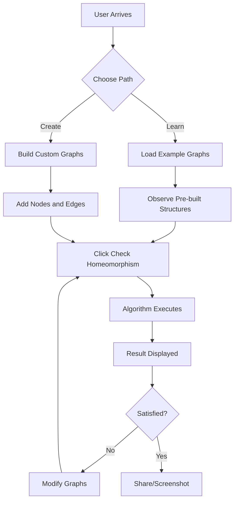

# Graph Homeomorphism Checker - Project Design

## Project Overview

An interactive web-based tool for visualizing and checking graph homeomorphism, designed as a portfolio piece to demonstrate technical competence in algorithms, mathematical concepts, and modern frontend development. The application targets an academic audience while maintaining accessibility for general portfolio visitors.

### Core Purpose
- Provide an interactive platform for creating and comparing graph structures
- Implement proper graph homeomorphism detection algorithm
- Optionally support graph isomorphism checking as an additional feature
- Showcase algorithmic thinking and clean UI/UX design skills

### Technology Constraints
- Vanilla JavaScript (no frameworks)
- HTML5 and CSS3
- Cytoscape.js for graph visualization
- Static deployment on GitHub Pages

## Design Principles

### Visual Identity
- **Color Scheme**: Pastel color palette with soft, pleasing tones
- **Typography**: Modern, clean fonts (sans-serif family)
- **Design Language**: Rounded corners, soft shadows, gentle transitions
- **Aesthetic**: Clean, minimal, professional with colorful accents

### User Experience
- Intuitive graph manipulation through mouse interactions
- Clear visual feedback for all user actions
- Responsive design for different screen sizes
- Educational value through subtle guidance

## Feature Specification

### 1. Interactive Graph Canvas

#### Two-Panel Layout
- Side-by-side graph canvases for comparison
- Equal visual weight and prominence
- Clear labeling (Graph A, Graph B)
- Synchronized interaction patterns

#### Graph Manipulation Capabilities

| Action | Interaction | Visual Feedback |
|--------|-------------|-----------------|
| Add Node | Left-click on empty space | Node appears with smooth fade-in animation |
| Remove Node | Right-click on node | Node disappears with fade-out, connected edges removed |
| Create Edge | Click and drag between nodes | Visual line follows cursor, edge created on release |
| Node Selection | Hover over node | Highlight effect, cursor change |
| Edge Visualization | Automatic | Bezier curves for aesthetic flow |

#### Visual Enhancements Needed
- Pastel node colors (different for each graph)
- Rounded node shapes
- Smooth edge curves
- Hover effects with subtle color transitions
- Node labels with improved typography

### 2. Homeomorphism Detection Algorithm

#### Algorithm Requirements
The system must implement a proper graph homeomorphism detection algorithm that goes beyond simple node/edge counting.

#### Graph Homeomorphism Definition
Two graphs G1 and G2 are homeomorphic if they can be obtained from the same graph by subdividing edges (inserting degree-2 nodes into edges).

#### Detection Strategy

**Phase 1: Graph Simplification**
- Identify and remove all degree-2 nodes from both graphs
- Collapse chains of degree-2 nodes into single edges
- Preserve the underlying structure

**Phase 2: Structural Comparison**
After simplification, check if the resulting graphs are isomorphic:
- Compare degree sequences
- Verify structural equivalence
- Account for edge subdivisions

#### Algorithm Output
- Boolean result: homeomorphic or not
- Visual indication of the result
- Optional: Highlight structural differences or similarities

### 3. Graph Isomorphism Detection (Optional Enhancement)

#### Purpose
Provide additional algorithmic depth by implementing graph isomorphism checking as a separate feature.

#### Isomorphism Definition
Two graphs are isomorphic if there exists a bijection between vertices that preserves adjacency.

#### Detection Approach
- Degree sequence analysis
- Adjacency matrix comparison
- Backtracking algorithm for vertex mapping
- Hash-based comparison for optimization

#### User Interface Integration
- Separate button: "Check Isomorphism"
- Clear distinction from homeomorphism check
- Educational tooltip explaining the difference

### 4. Example Graphs Feature

#### Purpose
Help users understand graph concepts and test the algorithm without manually creating graphs.

#### Example Graph Library

| Example Name | Description | Homeomorphism Pair |
|--------------|-------------|-------------------|
| Simple Triangle | Basic 3-node cycle | Triangle vs Triangle with subdivided edge |
| Star Graphs | Central node with spokes | 4-star vs 4-star variations |
| Path Graphs | Linear node chains | Path-4 vs Path-4 with subdivision |
| Complete Graphs | Fully connected | K3 vs K3 with edge subdivision |
| Non-Homeomorphic Pair | Different structures | Tree vs Cycle for negative example |

#### User Experience
- "Load Example" dropdown or button set
- Clear labels indicating what each example demonstrates
- Option to load examples into Graph A, Graph B, or both
- Visual transition when loading (smooth node/edge appearance)

### 5. Tutorial and Educational Elements

#### Inline Tutorial
A concise, one-line explanation positioned prominently near the top of the interface.

**Suggested Tutorial Text:**
"Two graphs are homeomorphic if one can be transformed into the other by subdividing edges (adding degree-2 nodes along edges)."

#### Additional Educational Touches
- Tooltip on "Check Homeomorphism" button explaining what it does
- Visual indicators of degree-2 nodes during detection
- Brief explanation in result display

### 6. User Interface Layout

#### Component Hierarchy

```
┌─────────────────────────────────────────────────────────┐
│                   Page Header                           │
│  Title: "Graph Homeomorphism Checker"                   │
│  Subtitle/Tutorial: One-line explanation                │
└─────────────────────────────────────────────────────────┘
┌─────────────────────────────────────────────────────────┐
│              Interaction Instructions                    │
│  Icon-based or color-coded instruction pills            │
└─────────────────────────────────────────────────────────┘
┌──────────────────────┬──────────────────────────────────┐
│                      │                                  │
│      Graph A         │         Graph B                  │
│   (Canvas Area)      │      (Canvas Area)               │
│                      │                                  │
│                      │                                  │
└──────────────────────┴──────────────────────────────────┘
┌─────────────────────────────────────────────────────────┐
│                 Control Panel                           │
│  [Load Example ▼] [Check Homeomorphism] [Check Iso]    │
└─────────────────────────────────────────────────────────┘
┌─────────────────────────────────────────────────────────┐
│                  Result Display                         │
│         (Shows algorithm output with styling)           │
└─────────────────────────────────────────────────────────┘
```

#### Responsive Behavior
- Desktop: Side-by-side graph panels
- Tablet: Slightly narrower panels, maintained side-by-side
- Mobile: Stacked layout with full-width panels

### 7. Visual Design Specifications

#### Color Palette (Pastel Theme)

| Element | Color Purpose | Suggested Tone |
|---------|---------------|----------------|
| Primary Background | Page background | Soft cream or light gray (#F5F5F0) |
| Graph A Nodes | Visual distinction | Pastel blue (#A8DADC) |
| Graph B Nodes | Visual distinction | Pastel coral (#FFB5A7) |
| Edges | Connections | Soft gray (#CCCCCC) |
| Accent/Buttons | Interactive elements | Pastel mint or lavender (#B4E7CE) |
| Success State | Positive result | Pastel green (#C1E1C1) |
| Negative State | Negative result | Pastel pink (#FFD4D4) |

#### Typography
- **Heading Font**: Modern sans-serif (Inter, Poppins, or system: -apple-system, BlinkMacSystemFont)
- **Body Font**: Clean, readable sans-serif
- **Size Hierarchy**: Clear distinction between h1, h2, and body text
- **Weight**: Medium for headings, regular for body

#### Styling Elements
- **Border Radius**: 12-16px for containers, 8px for buttons
- **Shadows**: Soft box-shadows for depth (e.g., 0 4px 6px rgba(0,0,0,0.1))
- **Transitions**: 0.3s ease for hover effects
- **Button States**: Hover, active, and disabled states with subtle color shifts

### 8. Interaction Flow

#### Primary User Journey



#### Interaction States

**Initial State**
- Empty graph canvases
- Instructions visible and prominent
- Example dropdown available
- Check buttons disabled (enabled when both graphs have content)

**Editing State**
- Active graph manipulation
- Visual feedback on hover
- Real-time node/edge updates
- Clear affordances for all actions

**Result State**
- Result message displayed with appropriate styling
- Graphs remain editable
- Option to check again or modify
- Visual indication of homeomorphism/non-homeomorphism

### 9. Algorithm Implementation Requirements

#### Homeomorphism Detection Logic

**Input Processing**
- Extract graph structure from Cytoscape instances
- Build adjacency list representation
- Identify node degrees

**Degree-2 Node Removal**
- Traverse each graph
- Identify nodes with exactly 2 neighbors
- Merge incident edges
- Track subdivisions for verification

**Structural Comparison**
- Generate canonical form of simplified graphs
- Compare degree sequences
- Verify edge connectivity patterns
- Return boolean result with confidence

#### Isomorphism Detection Logic (Optional)

**Input Processing**
- Same as homeomorphism (adjacency list)

**Quick Rejection Tests**
- Node count mismatch
- Edge count mismatch
- Degree sequence mismatch

**Detailed Comparison**
- Generate adjacency matrices
- Apply graph isomorphism algorithm (VF2 or backtracking)
- Return result

### 10. Data Structures

#### Graph Representation

**Node Object**
- id: unique identifier
- position: {x, y} coordinates
- degree: number of incident edges
- neighbors: array of connected node ids

**Edge Object**
- id: unique identifier
- source: node id
- target: node id

**Adjacency List**
- Map structure: nodeId → array of neighbor nodeIds
- Efficient for traversal and degree calculation

#### Example Graph Definition Format

```
Example Graph Structure:
{
  name: "Triangle vs Subdivided Triangle",
  graphA: {
    nodes: [{id, position}, ...],
    edges: [{source, target}, ...]
  },
  graphB: {
    nodes: [{id, position}, ...],
    edges: [{source, target}, ...]
  },
  expectedResult: true/false
}
```

### 11. Performance Considerations

#### Algorithm Complexity
- Homeomorphism detection: Polynomial in number of nodes (after simplification)
- Isomorphism detection: Exponential worst-case, but practical for small graphs
- Target graph size: Up to 20-30 nodes for responsive performance

#### Optimization Strategies
- Early rejection based on simple invariants
- Lazy computation (only when check button clicked)
- Debouncing for real-time validation (if implemented)

### 12. Accessibility and Usability

#### Accessibility Features
- Keyboard navigation for controls (tab order)
- ARIA labels for interactive elements
- Clear focus indicators
- Sufficient color contrast (despite pastel palette)
- Alt text for visual elements

#### Usability Enhancements
- Clear error messaging (if invalid graph state)
- Undo/redo capability (nice-to-have)
- Clear all functionality
- Visual confirmation for actions

### 13. GitHub Pages Deployment Considerations

#### Repository Structure
- All assets in root or organized folders
- No build process required (vanilla JS)
- Relative paths for all resources
- CDN for external libraries (Cytoscape.js)

#### SEO and Metadata
- Descriptive page title
- Meta description for social sharing
- Open Graph tags for preview cards
- Favicon with project branding

#### Documentation
- README with project description
- Screenshot or GIF demonstration
- Link to live demo
- Brief explanation of algorithms used

### 14. Success Metrics

#### Portfolio Impact Goals
- Demonstrate algorithmic problem-solving
- Showcase clean, modern UI design
- Exhibit understanding of graph theory
- Display attention to detail and polish

#### Technical Achievements to Highlight
- Implementation of non-trivial algorithm
- Effective use of visualization library
- Clean, maintainable vanilla JavaScript
- Responsive, accessible design

## Implementation Phases

### Phase 1: Visual Redesign
- Update CSS with pastel color scheme
- Implement rounded corners and modern typography
- Add smooth transitions and hover effects
- Improve layout spacing and composition

### Phase 2: Enhanced Graph Interaction
- Refine node and edge styling in Cytoscape config
- Improve visual feedback for interactions
- Add animation for node/edge creation/deletion
- Polish cursor states and affordances

### Phase 3: Algorithm Implementation
- Implement homeomorphism detection algorithm
- Create graph simplification logic (degree-2 removal)
- Build structural comparison mechanism
- Test with various graph configurations

### Phase 4: Example Graphs System
- Design example graph data structure
- Create 4-6 example graph pairs
- Build UI for loading examples
- Implement smooth loading transitions

### Phase 5: Educational Elements
- Add one-line tutorial text
- Create tooltips for buttons
- Enhance result display with context
- Add brief explanations where helpful

### Phase 6: Optional Isomorphism Feature
- Implement isomorphism detection
- Add separate UI control
- Differentiate from homeomorphism clearly
- Test and validate results

### Phase 7: Polish and Deployment
- Cross-browser testing
- Responsive design verification
- Performance optimization
- Deploy to GitHub Pages
- Update repository README

## Technical Constraints and Considerations

### Browser Compatibility
- Modern browsers (Chrome, Firefox, Safari, Edge)
- ES6+ JavaScript features acceptable
- Graceful degradation for older browsers (optional)

### Performance Boundaries
- Graph size limit: 30 nodes recommended maximum
- Algorithm timeout: Consider max execution time
- Visualization performance: Cytoscape.js handles rendering

### Code Quality Standards
- Clear function naming and organization
- Commented algorithm logic
- Separation of concerns (UI vs algorithm logic)
- Consistent code style

## Risk Mitigation

### Algorithm Complexity Risk
**Risk**: Homeomorphism detection is computationally complex
**Mitigation**: Implement early rejection tests, limit graph size, show loading state for complex computations

### User Confusion Risk
**Risk**: Users may not understand graph homeomorphism concept
**Mitigation**: Provide example graphs, clear tutorial text, visual demonstrations

### Visual Design Risk
**Risk**: Pastel colors may reduce readability
**Mitigation**: Ensure sufficient contrast, test with various displays, provide clear visual hierarchy

### Cross-Browser Risk
**Risk**: Cytoscape.js or interactions may not work consistently
**Mitigation**: Test on multiple browsers, use polyfills if needed, document supported browsers
